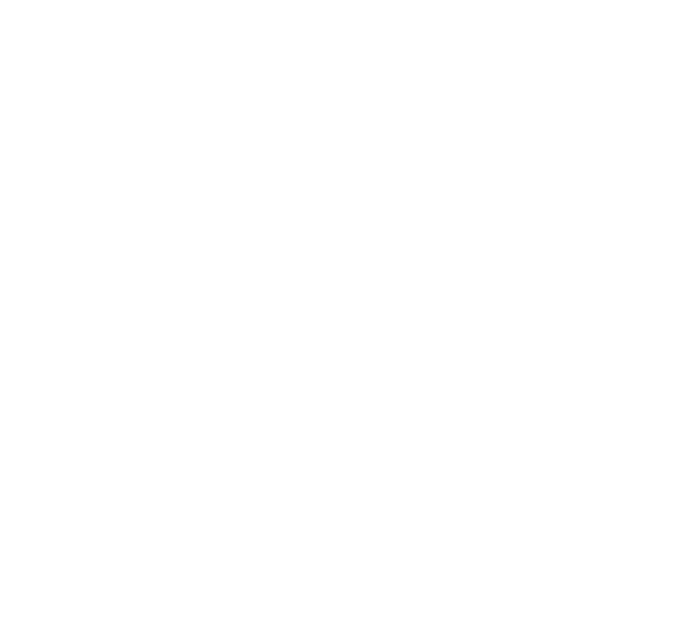

<div align=center>



</div>
<h1 align=center>Very Little Nightmares — Nintendo Switch port</h1>

A wrapper/port of the Android release of **Very Little Nightmares** (v1.2.6). It
loads the original game binaries (`libunity.so` / `libil2cpp.so`, Unity 2021.3
IL2CPP, arm64), resolves their imports against native Switch implementations and
patches them so the game runs as if inside a minimal Android environment.

## How to install

Create a folder for the game on your SD card, `/switch/vln_nx/`, and place:

1. `vln_nx.nro`
2. `libmain.so`, `libunity.so`, `libil2cpp.so` — extracted from the APK's
   `lib/arm64-v8a/` folder.
3. `assets/` — the **contents** of the APK or extracted dump's `assets/`
   folder.
4. `main.147.eu.bandainamcoent.verylittlenightmares.obb`. 
   If the extracted dump already includes the large complete file (about 424 MB) and the loose `sharedassets*.resource` files, the OBB install part will be skipped.

```
/switch/vln_nx/
  vln_nx.nro
  libmain.so  libunity.so  libil2cpp.so
  assets/
    bin/Data/ ...
  main.147.eu.bandainamcoent.verylittlenightmares.obb  # only for split dumps
```

On **first launch**, the port uses complete extracted assets directly. When an
OBB is present, it unpacks and merges the game data, then deletes the OBB to
reclaim space.

Launch with a **game override** (hold R while starting a title) or a
forwarder.

## Configuration

`config.txt` is created next to the `.nro` on first run:

* `screen_width` / `screen_height` — render resolution; `-1` (default) picks
  720×1280 in handheld and 1080×1920 docked.
* `portrait` — the render is rotated 90° to fill the screen (hold the console
  rotated to play): `1` (default) rotates clockwise (**right** Joy-Con up); `2`
  rotates the other way (left Joy-Con up).
* `language` — `0` (default) follows the Switch system language;

## Build

devkitA64 plus these portlibs:

```
pacman -S switch-mesa switch-libdrm_nouveau switch-sdl2 switch-zlib
```

Then `make`. See `BUILD.md` for the full toolchain and data-staging details.

## Credits

* **TheOfficialFloW** & **Andy Nguyen** — the original Android so-loader.
* **fgsfds** — the Switch so-loader groundwork reused here.
* **ChanseyIsTheBest** - Help on Unity / Zookeeper DX Port

### Support

If you enjoy my work and want to support me :

[](https://ko-fi.com/D1D1P2MOG)

## Legal

No affiliation with Bandai Namco or Tarsier Studios. "Very Little Nightmares" is
a trademark of its owner. This repository contains no assets or program code
from the original game, and none may be distributed with builds. Users must
extract the required files from their own legally obtained copy.

Source code is provided under the MIT License (see LICENSE).
